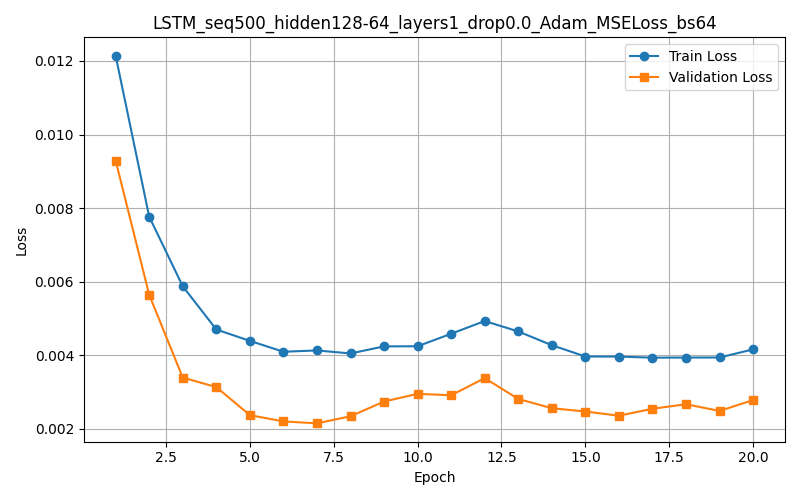

# Performance Comparison of Sequential and Non-Sequential Models
### Hang Truong (s0589108)

This analysis compares the training and validation loss curves across non-sequential models (FeedForward, Conv1D) and sequential models (LSTM, GRU, BiLSTM) over 20 epochs.

Experiment with various options such as activation functions, number of layers, number of hidden nodes per layer, optimization algorithms, loss functions, sequence length, batch size and type of target variable.

---

## 1. BiLSTM Model 

| Metric | Epoch Range | Observation | Conclusion |
| :--- | :--- | :--- | :--- |
| **Train Loss** | 1 to 20 | Drops sharply from ~0.009 to ~0.004 by epoch 5, then stabilizes around ~0.004 for the remainder. | The model learns the training data rapidly and converges well. |
| **Validation Loss** | 1 to 20 | Drops sharply from ~0.012 to ~0.0015 by epoch 4, then remains very low and stable around ~0.002 | Excellent generalization. The validation loss is consistently and significantly lower than the training loss, suggesting superior performance on unseen data (possibly due to an "easier" validation set or the difference in batch statistics). |
| **Overfitting** | N/A | No signs of overfitting. The gap is reversed (Validation < Train). | Highly stable and effective model. This appears to be one of the best-performing sequential models. |
| **Final Loss Value** | 20 | Low (Train: ~0.004, Validation: ~0.002). | Lowest final validation loss value among all models. |

---

## 2. GRU Model 

| Metric | Epoch Range | Observation | Conclusion |
| :--- | :--- | :--- | :--- |
| **Train Loss** | 1 to 20 | Decreases quickly from ~0.0095 to ~0.004 by epoch 7, then remains stable, fluctuating slightly around ~0.004. | Effective learning and good convergence on the training set. |
| **Validation Loss**| 1 to 20 | Decreases rapidly from ~0.0037 to ~0.0025 by epoch 8 and then stabilizes at ~0.0025. | Excellent generalization. The validation loss is consistently lower than the training loss after epoch 1, indicating strong performance on unseen data. |
| **Overfitting** | N/A | No signs of overfitting (Validation Loss is lower). The model appears well-regularized (drop0.2 is used). | Highly stable and well-regularized. This is another top-performing sequential model. |
| **Final Loss Value** | 20 | Low (Train: ~0.0039, Validation: ~0.0025). | A close second in terms of final validation performance. |

---

## 3. LSTM Model 

| Metric | Epoch Range | Observation | Conclusion |
| :--- | :--- | :--- | :--- |
| **Train Loss** | 1 to 20 | Drops sharply from ~0.012 to ~0.004 by epoch 7, then shows slight fluctuations/minor re-increases between epochs 10 and 13 before stabilizing around ~0.004 | Good initial learning, but the mild fluctuations suggest minor instability or a complex loss landscape. |
| **Validation Loss**| 1 to 20 | Drops sharply, then stabilizes and begins a slow, upward trend from epoch 7 ~0.0021 to epoch 12 ~0.0033, before stabilizing again around ~0.0028. | Good generalization overall, but the slight rise indicates a minor risk of overfitting setting in after epoch 7. |
| **Potential Overfitting**| Epochs 7-12 | After epoch 7, the training loss and validation loss begin to diverge and the validation loss slightly increases. | Slight evidence of overfitting. Early stopping around epoch 7 might have yielded the best validation performance ~0.0021. |
| **Final Loss Value** | 20 | Low (Train: ~0.004, Validation: ~0.0028). | Good, but slightly worse than the BiLSTM and GRU models. |

---

## 4. FeedForward Model 

| Metric | Epoch Range | Observation | Conclusion |
| :--- | :--- | :--- | :--- |
| **Train Loss** | 1 to 20 | Drops extremely quickly from ~0.055 to ~0.007 by epoch 4, then stabilizes and remains low, around ~0.003. | Very fast initial learning, indicating the non-sequential features are easily learned. |
| **Validation Loss**| 1 to 20 | Drops quickly ~0.088 to ~0.007 by epoch 4. It remains very low, fluctuating around ~0.004 to ~0.006 | Excellent generalization. The validation loss closely tracks the training loss after epoch 4. |
| **Overfitting**| N/A | The curves track closely, and the final validation loss is only slightly higher than the training loss. No significant overfitting. | Highly stable and effective non-sequential model. The dropout of 0.1 appears effective. |
| **Final Loss Value** | 20 | Low (Train: ~0.003, Validation: ~0.004). | Very low final losses, demonstrating a strong capability for non-sequential data. |

---

## 5. Conv1D Model 

| Metric | Epoch Range | Observation | Conclusion |
| :--- | :--- | :--- | :--- |
| **Train Loss** | 1 to 20 | Drops extremely quickly from ~0.054 to ~0.007 by epoch 4, then remains stable and very low around ~0.003. | Very fast and effective learning on the training data. |
| **Validation Loss**| 1 to 20 | Drops extremely quickly from ~0.115 to ~0.007 by epoch 4, then stabilizes and remains very low, around ~0.004. | Excellent generalization. The loss tracks the training loss closely after the initial rapid descent. |
| **Overfitting**| N/A | The curves track closely with minimal divergence. The dropout of 0.1 appears highly effective. | Highly stable and well-regularized. No evidence of overfitting. |
| **Final Loss Value** | 20 | Very low (Train: ~0.003, Validation: ~0.004). | Achieves the lowest absolute training loss and strong validation performance. |

## Ranking by Generalization (Final Validation Loss)

| Rank | Model Architecture | Final Validation Loss | Final Train Loss | Generaliration Behavior | Bes Val Loss Epoch |
| :--- | :--- | :--- | :--- | :--- | :--- |
| **1st** | **BiLSTM** | ~0.0020 | ~0.0040 | Validation < Train (Best Generalization) | ~4 |
| **2nd** | **GRU** | ~0.0025 | ~0.0039 | Validation < Train (Very Strong Generalization) | ~8 |
| **3rd** | **LSTM** | ~0.0028 | ~0.0040 | Validation ~ Train (Minor Overfitting Risk) | ~7 |
| **4th** | **Conv1D** | ~0.0040 | ~0.0030 | Validation > Train (Slight Overfitting) | ~5 |
| **5th** | **FeedForward** | ~0.0040 | ~0.0030 | Validation > Train (Slight Overfitting) | ~18 |

### Conclusion:

1. **Recurrent Models Dominate Generalization**: The **BiLSTM** and **GRU** models achieved the two lowest validation losses. The unusual pattern of **Validation Loss < Training Loss** suggests that the recurrent architectures, particularly for sequential data, learned the general underlying patterns very effectively, or that the validation data was slightly "easier" to predict.

2. **Conv1D and FeedForward are Highly Efficient**: The **Conv1D** model reached optimal performance the quickest (by epoch 5). The **FeedForward** model, though the simplest, was also highly effective, proving that complex recurrent layers aren't strictly necessary for a very low loss, although its validation loss was higher than the recurrent models.

3. **LSTM Shows Instability**: The **LSTM** model had the highest final validation loss among the sequential models and exhibited minor fluctuations and a slight re-increase in validation loss, indicating a higher propensity for **overfitting** compared to the BiLSTM and GRU.

4. **Best Model**: For optimal generalization and lowest absolute error on unseen data, the **BiLSTM** is the clear winner. For the fastest convergence with excellent performance, the **Conv1D** is the winner.